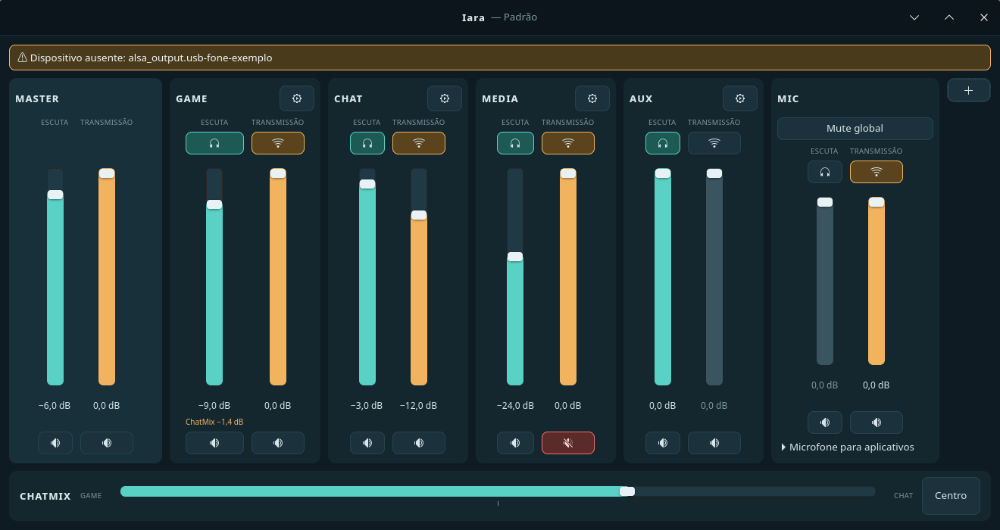

# Iara

Mixer de áudio para Linux, em Rust e GTK4. Licença MIT.

O motor `iara-audio` cria nós virtuais `iara.*` no PipeWire da sessão enquanto o processo vive; o serviço, o IPC e a janela ainda não o usam. Nada é feito com dispositivos físicos nem com aplicativos. Veja [especificacao.md](docs/especificacao.md), especialmente a seção 6.3.

## Organização

- `iara-core`: domínio compartilhado, ganhos, envios, fórmula do ChatMix e plano de topologia (`topology`: perfil → nós e ramos, diff); sem GTK/PipeWire.
- `iara-store`: persistência em TOML versionado (perfis, configuração, histórico de 50 revisões), gravação atômica com cópia válida anterior, duplicação, importação e exportação; valida tudo na entrada.
- `iara-ipc`: contrato D-Bus (`dev.iara.Mixer1`), servidor e cliente tipado; sem dependência do serviço nem do PipeWire.
- `iara-audio`: motor PipeWire; aplica um plano por diferença no próprio processo (nós, loopbacks, ganho/mute por Props). Precisa de libpipewire e clang.
- `iara-service`: serviço de sessão: perfil ativo, supervisão e reconexão do motor, autosave e histórico. Expõe o contrato D-Bus.
- `iara-ui`: janela GTK4 (feature `gtk-ui`) sobre um modelo de apresentação testável sem GTK; fala com o serviço só pelo cliente D-Bus.

As provas da spec 6.3.2 estão em `docs/provas/registro.md` e `tools/provas/`; `tools/provas/07-motor-e2e.sh` exercita o motor real de ponta a ponta (cria nós temporários na sessão, mede e remove).

## Verificação

Requer Rust/Cargo e acesso ao registro de dependências. A interface também exige bibliotecas de desenvolvimento GTK4, pkg-config e ambiente gráfico. A versão gtk-rs 0.10 é uma seleção inicial, ainda sujeita à resolução e compilação.

```sh
cargo fmt --all --check
cargo test -p iara-core
cargo check --workspace
cargo check -p iara-ui --features gtk-ui
cargo run -p iara-ui --features gtk-ui
```

Ainda não há `Cargo.lock`: gere-o e versioná-lo após a primeira resolução bem-sucedida. O ambiente de criação não possuía Cargo/Rust nem GTK4/PipeWire disponíveis; compilação e testes Rust não foram executados. Manifestos e empacotamento foram verificados com Python.

## Próximo bloqueio técnico

Execute as provas da seção 6.3 numa sessão Linux com PipeWire/WirePlumber. Meça os dois ramos capturados, não apenas sliders ou metadata. Só então escolha loopback, filter-chain ou processamento próprio e implemente o backend.

## Janela



```sh
cargo run -p iara-service                                 # serviço (cria nós iara.* no PipeWire da sessão)
cargo run -p iara-ui --features gtk-ui                    # janela, conecta ao serviço
cargo run -p iara-ui --features gtk-ui -- --demo          # dados de exemplo, sem serviço
cargo run -p iara-ui --features gtk-ui -- --demo --screenshot captura.png   # grava a janela em PNG e sai
```

`tools/provas/13-ui-ao-vivo.sh` abre a janela contra um serviço de teste, muda valores por fora (`busctl`) e captura o resultado.
