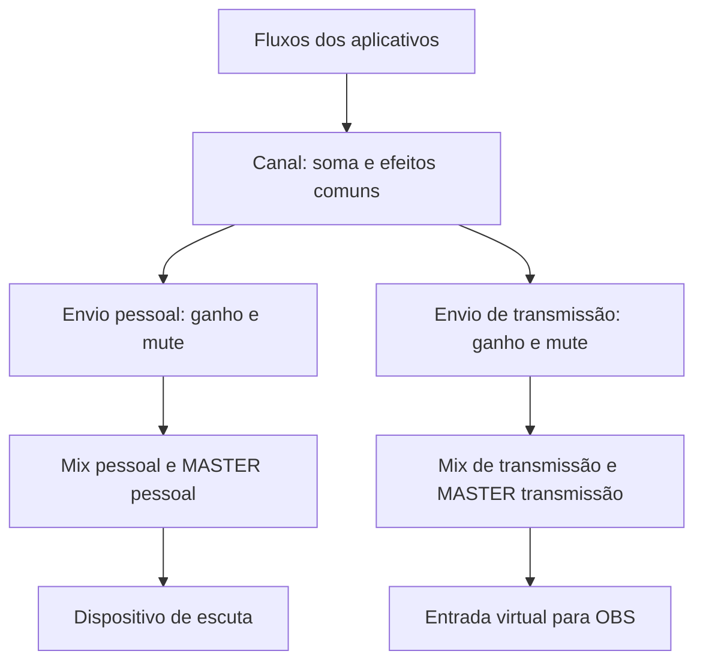

# Iara — Mixer de áudio para Linux

Concepção e especificação

Versão: 0.10 · Data: 05/10/2026 · Autor da ideia: Bianco Oliveira

Nome do produto: **Iara** (confirmado). Documento evolutivo; ainda não é uma especificação de implementação fechada.

## 1. Objetivo

Criar um mixer de áudio para Linux que organize aplicativos e dispositivos em canais personalizáveis, com controle independente de escuta e transmissão, efeitos e restauração automática da configuração. O usuário deve conseguir usar o sistema diariamente sem reconstruir conexões manualmente.

A referência principal é a tela de mixer do SteelSeries Sonar enviada na conversa: colunas de canais, aplicativos associados, dois controles por canal, medidores e acesso às configurações. A identidade visual será própria.

## 2. Estado das decisões

- **Confirmado:** escolha expressamente aceita pelo usuário.
- **Proposta:** comportamento recomendado neste documento, sujeito a discussão.
- **Pendente:** escolha que exige definição ou validação técnica.

### Confirmado

- Linux como plataforma inicial; Rust como linguagem; GTK4 como toolkit da interface.
- Serviço separado da janela, integração com PipeWire/WirePlumber e configuração persistente.
- Perfis salvos e canais personalizáveis.
- Estrutura inicial com MASTER, GAME, CHAT, MEDIA, AUX e MIC.
- GAME, CHAT, MEDIA e AUX podem ser renomeados ou removidos; novos canais podem ser criados.
- MIC concentra o controle do microfone do usuário.
- Referências essenciais: colunas, associação de aplicativos, escuta/transmissão independentes, medidores e configurações por canal.
- Aplicativos sem associação devem continuar audíveis por um grupo interno de entrada geral apresentado dentro do MASTER; a organização visual exata é proposta abaixo.
- Salvamento automático no perfil ativo e duplicação de perfis.
- Mover aplicativos salva a associação; existe opção de alteração apenas nesta sessão.
- Avisar quando o encaminhamento solicitado não puder ser aplicado ou mantido pelo aplicativo.
- Remoção de canal com escolha do destino; troca de perfil preservando dispositivos ausentes; fone sem fallback automático para alto-falantes; restauração do último perfil sem abrir a janela.
- Escopo inicial confirmado: toda a funcionalidade discutida até esta revisão, incluindo os dois mixes, MIC virtual, ChatMix, gestão/recuperação de perfis e retorno ao áudio normal. Apenas efeitos de áudio ficam para uma etapa posterior. Detalhes técnicos e semânticas ainda abertos continuam sujeitos a definição.
- Cada canal pode participar simultaneamente dos mixes pessoal e de transmissão, com controles independentes.
- Associação do aplicativo inteiro como comportamento padrão.
- MIC com mute global para todos os destinos e ganho/mute independentes nos envios pessoal e de transmissão.
- Dispositivos preferidos por perfil como padrão; opção global de compartilhar escolhas físicas entre perfis.
- Reconectar dispositivo preferido automaticamente quando voltar, desde que o usuário não tenha escolhido outro durante a ausência.
- Alterações externas respeitadas temporariamente, com oferta de salvar; opção por aplicativo para obedecer sempre ao mixer.
- ChatMix atenua o lado desfavorecido sem aumentar o outro nem reescrever os volumes individuais.
- Histórico agrupa ajustes contínuos e registra ações estruturais.
- Entrada virtual dedicada do MIC com ganho próprio, independente dos ganhos de retorno pessoal e transmissão.
- Compartilhamento global de dispositivos com opções separadas para saída e microfone.
- Substituição temporária de associação termina ao encerrar o aplicativo, trocar de perfil ou reaplicar a regra.
- Ao ativar o mixer, sua saída virtual geral torna-se a saída padrão de reprodução do sistema.
- No perfil inicial, GAME, CHAT, MEDIA e MIC têm envio de transmissão habilitado; AUX desabilitado. O grupo interno Não atribuídos continua fora da transmissão. MASTER controla a soma, não constitui fonte adicional.
- Uma entrada física de microfone selecionada por perfil.
- Nome do projeto confirmado: **Iara**. Licença adotada: MIT, conforme a preferência apresentada e a solicitação de fechar as pendências documentais.
- Desenvolvimento atual: especificação e esqueleto Cargo; backend de áudio depende de prova técnica.

### Detalhes ainda sujeitos a definição

- MASTER e MIC fixos e controles finais independentes estão no escopo inicial; detalhes de reset/desativação precisam ser definidos.
- Monitoramento do microfone desligado inicialmente.
- ChatMix está no escopo inicial; fórmula e interação com sliders definidas na seção 8.14, revisão 0.9.
- Importação/exportação e recuperação de perfis estão no escopo inicial; TOML e retenção de 50 revisões definidos na revisão 0.9. A apresentação do grupo interno do MASTER ainda precisa de desenho.
- Detalhes de recuperação, alterações externas e políticas adicionais descritas adiante.

## 3. Conceitos do domínio

| Conceito | Definição |
| --- | --- |
| Aplicativo | Origem lógica de áudio; pode ter vários fluxos ou processos. |
| Fluxo | Instância de reprodução ou captura exposta pelo aplicativo ao sistema de áudio. |
| Canal do mixer | Grupo lógico de fontes, com identidade, controles e regras. Não confundir com canais de sinal, como esquerdo/direito. |
| Dispositivo | Entrada ou saída física, como USB, HDMI ou Bluetooth. |
| Mix pessoal | Soma dos sinais enviados à escuta do usuário. |
| Mix de transmissão | Soma dos sinais disponibilizados para gravação/live. |
| Entrada virtual | Fonte que outros aplicativos podem selecionar para captura. |
| Perfil | Configuração persistente de canais, regras, ganhos, destinos e processamento. |
| Estado desejado | Escolhas persistentes do usuário, inclusive para dispositivos e aplicativos ausentes. |
| Estado observado | Objetos, parâmetros e conexões que existem agora no sistema. |

## 4. Estrutura inicial do mixer

| Elemento | Função | Estado |
| --- | --- | --- |
| MASTER | Controle geral; proposta de atuar após a soma de cada mix. | Existência, controles duplos e permanência no escopo inicial. |
| GAME | Grupo inicial para jogos. | Personalização confirmada. |
| CHAT | Grupo inicial para conversas e chamadas. | Personalização confirmada. |
| MEDIA | Grupo inicial para música, vídeos e conteúdo. | Personalização confirmada. |
| AUX | Grupo inicial de uso livre. | Personalização confirmada. |
| MIC | Entrada de microfone, processamento e encaminhamento. | Função e permanência no escopo inicial. |
| Outros | Canais criados pelo usuário. | Criação confirmada. |

O MASTER não recebe diretamente todos os aplicativos: ele controla a soma final dos mixes. Para aplicativos sem associação, haverá um grupo interno anterior à soma, apresentado na área do MASTER, sem criar mais uma coluna. Esse grupo não equivale a AUX e não desaparece por passagem de tempo.

Os nomes iniciais não determinam regras automáticas infalíveis. Cada canal tem identificador persistente próprio; renomeá-lo não invalida associações.

## 5. Caminho lógico do áudio

Aplicativos são associados a canais. Após o processamento comum do canal, o sinal se divide em dois envios, cada um com ganho, mute e habilitação próprios. O volume original do aplicativo é anterior a essa divisão.

O diagrama é conceitual: a composição exata de nós, módulos e buffers depende de prova técnica. Duplicar conexões do mesmo sinal, sem processamento independente nos ramos, não garante volumes separados.

### Microfone

Proposta: microfone físico → processamento MIC → entrada virtual de microfone. Esse sinal também pode ser enviado ao mix pessoal e ao mix de transmissão.

A entrada virtual de microfone deve permanecer separada do mix completo: selecionar o microfone no Discord não deve incluir automaticamente o áudio de reprodução do próprio Discord. O MASTER dos mixes não altera essa entrada dedicada. Um mute global do MIC atua antes de todos os seus destinos; mutes dos envios atuam apenas no destino correspondente.

### Semântica dos controles

- Ganho e mute são propriedades distintas; desmutar restaura o ganho anterior.
- Desabilitar um envio remove sua participação naquele mix, preservando sua configuração.
- MASTER pessoal altera a soma pessoal; MASTER transmissão altera a soma de transmissão.
- Volume físico do dispositivo continua sendo uma camada separada do MASTER virtual.
- Proposta inicial: estéreo para reprodução/mixes e tratamento compatível com microfone mono; surround fica para evolução.
- Decisão de projeto 0.9: ganhos digitais de canal, envio, MASTER e MIC entre −60 e 0 dB, mais silêncio exato (−∞) no extremo inferior. 0 dB equivale à amplitude unitária; não há boost digital nesta versão inicial. Ganho físico do microfone é uma propriedade separada do dispositivo.
- Armazenar silêncio explicitamente (não serializar infinito em TOML). Ganho válido deve ser finito; amplitude = 10^(dB/20). Mute preserva o ganho salvo.
- Slider normalizado: posição 0 é silêncio; para 0 < p ≤ 1, dB = −60 + 60p. Exibir dB; não rotular −6 dB como uma percentagem arbitrária. Campo numérico admite −60 dB.
- Medidores de saída de cada ramo após ganhos/mutes; medidor do MIC comum antes da divisão. Pico de amostra em dBFS: 20 log10(max(abs(samples))); zero é −∞. Na interface, piso visual −60 dBFS, pico mantido por 1 s e indicador ≥ 0 dBFS mantido por 2 s. Trata-se de sample peak, não true peak.
- Soma em ponto flutuante pode exceder amplitude unitária mesmo sem boost. Não normalizar/limitar silenciosamente: sinalizar excesso e permitir reduzir ganhos; limiter é efeito posterior. Estratégia do formato final deve ser validada no backend.

## 6. Arquitetura

### 6.1 Serviço em Rust

Serviço da sessão do usuário, sem necessidade de privilégios administrativos durante o uso normal. Deve observar eventos de áudio, manter o estado desejado e aplicar as mudanças necessárias ao estado observado. Fechar a janela não encerra o serviço.

Responsabilidades propostas: inventário de fluxos/dispositivos; avaliação de regras; criação dos objetos virtuais sob sua gestão; controle de canais/mixes; persistência; reconexão; diagnóstico e comunicação com a interface.

### 6.2 Interface GTK4

Responsável por apresentar estado e enviar comandos ao serviço. A janela não é a proprietária do caminho de áudio. Ao reabrir, recebe um retrato atual e passa a acompanhar eventos. Não deve manter uma segunda configuração autoritativa.

A interface será desenhada para o mixer, com identidade própria, navegação por teclado, rótulos acessíveis e estados legíveis. Cor não será o único indicador de destino, mute ou erro.

### 6.3 Integração com PipeWire e WirePlumber

PipeWire é a base para objetos e processamento de áudio. WirePlumber permanece responsável por sua política de sessão. O serviço deve usar os mecanismos de encaminhamento existentes quando adequados e administrar explicitamente sua topologia interna.

Proposta: identificar todos os objetos criados pelo produto e restringir a reconciliação a eles e aos fluxos explicitamente associados. Não reescrever indiscriminadamente configurações globais nem disputar alterações repetidamente com outras ferramentas.

A escolha de implementação do backend é um bloqueio técnico explícito. Não está decidido que loopback, filter-chain ou nós próprios sejam a solução final. Loopback fornece encaminhamento e dispositivos virtuais; filter-chain oferece um grafo de processamento. O uso de gain/mixer builtin para controles básicos não significa antecipar os efeitos de usuário adiados.

#### 6.3.1 Hipóteses a comparar

| Hipótese | O que validar | Risco principal |
| --- | --- | --- |
| Sinks de canal e dois loopbacks de monitor | Volume de cada ramo independente e controlável, sem alterar o monitor compartilhado. | Ganho aplicado no nó errado ou duplicação por conexões automáticas. |
| Filter-chain com gain/mixer builtin | Controles atualizáveis em runtime, dois ramos e soma dos mixes. | Topologia/formato de portas, atualização dos controles e custo por canal. |
| Streams/filtros próprios | Ganhos por ramo e ciclo de vida explicitamente controlados pelo serviço. | Mais código de tempo real, buffers e negociação de formato. |

Proposta de hospedagem a testar primeiro: contexto PipeWire do serviço, que carrega/cria os objetos próprios enquanto está ativo. A janela não hospeda áudio. Comparar com objetos hospedados no daemon quando suportados; sua permanência exige política de limpeza após queda do cliente. Não assumir que carregar um módulo no contexto cliente seja equivalente a carregá-lo no daemon.

Bindings Rust: avaliar candidatos pela API necessária (registry, metadata, links, params, streams e módulos), compatibilidade da biblioteca C, manutenção e licenças. Não fixar versão antes de compilar uma prova. O core não importa bindings nem IDs transitórios do PipeWire.

#### 6.3.1.1 Estado do próprio Iara versus restauração do WirePlumber

Medido (docs/provas/registro.md, prova 03): o WirePlumber 0.5.18 persiste volume e mute de sinks e streams e os restaura quando o nó reaparece, podendo contaminar a execução seguinte. Decisão: todo nó criado pelo Iara declara `state.restore-props=false` e `state.restore-target=false` (função única de montagem de propriedades, com teste que impede criar nó sem o opt-out) e o serviço aplica explicitamente ganho e mute do perfil quando o nó aparece no registro. Não se desliga a restauração globalmente nem se altera a configuração do WirePlumber do usuário. Pendente: confirmar se o WirePlumber ainda grava entradas para nós com opt-out.

#### 6.3.1.2 Hospedagem: decisão

Confirmado: os objetos de áudio do Iara (sinks, loopbacks/streams, fontes virtuais) ficam no contexto PipeWire do serviço, sem módulos no daemon e sem `object.linger`. Fechar a janela mantém o serviço em segundo plano. Desligar o serviço é ação deliberada do usuário e derruba os canais; a ação “Desligar mixer / voltar ao áudio normal” restaura o destino padrão anterior. Queda inesperada do serviço ou reinício do PipeWire não têm promessa de áudio contínuo: os fluxos caem na saída física (medido, prova 04) e o serviço, ao voltar, reconecta, recria seus objetos sem duplicar e reencaminha os fluxos por metadata. Requisitos derivados: ouvir o erro do core, invalidar referências, reconstruir a partir do estado desejado e, por segurança, remover na inicialização qualquer objeto próprio remanescente (marcado por propriedade própria).

#### 6.3.2 Prova mínima e critérios de saída

1. Numa sessão Linux real com PipeWire/WirePlumber, criar um canal e dois destinos capturáveis independentes. Gerar sinal conhecido e registrar rate/quantum/formato.
2. Aplicar −6 dB apenas ao ramo pessoal: medir aproximadamente metade da amplitude anterior nesse ramo (tolerância ±0,2 dB), enquanto transmissão muda menos de 0,1 dB. Inverter os ramos e repetir.
3. Mutar cada ramo sem afetar o outro; testar MASTER depois da soma com dois canais. Verificar ausência de cópias duplicadas do sinal.
4. Verificar que Não atribuídos não aparece na transmissão e que MIC dedicado permanece independente dos outros dois envios.
5. Selecionar a fonte de transmissão em um cliente de captura e o MIC dedicado em outro. Testar ausência/reconexão da entrada física com fonte virtual estável.
6. Desconectar saída física, reiniciar PipeWire e encerrar o processo proprietário. Registrar quais objetos permanecem, somem ou são recriados; detectar fallback indevido e objetos órfãos.
7. Exercitar mudança de aplicativo via metadata, política externa e seleção explícita de dispositivo. Registrar limites detectáveis, sem declarar sucesso só porque um comando foi aceito.
8. Registrar CPU, RAM, latência observada e xruns com medidores ativos/inativos. Guardar comandos, versões, capturas e decisão final num registro técnico no repo.

A prova fecha topologia, hospedagem, binding/versão e requisitos mínimos da distribuição. Até lá, o serviço contém backend explicitamente indisponível; o workspace compilar, isoladamente, não demonstra ganhos independentes nem recuperação de áudio.

### 6.4 Comunicação e processamento

Proposta inicial: D-Bus da sessão para comandos, retrato de estado e eventos. A frequência e o transporte dos medidores devem ser avaliados separadamente. A comunicação da interface não transporta os samples de áudio.

Processamento em tempo real deve evitar operações de disco, esperas de interface e alocações imprevisíveis no callback de áudio. Metadados, persistência e regras ficam fora desse caminho. Medidores podem ter atualização limitada e suspensa quando não há interface visível.

## 7. Modelo persistente proposto

| Entidade | Dados principais |
| --- | --- |
| Configuração global | Versão do schema, perfil ativo, preferências de interface e inicialização. |
| Perfil | ID, nome, canais, regras, destinos preferidos e políticas de fallback. |
| Canal | ID, nome, cor, ordem, efeitos e envios por mix. |
| Regra | Identidade/condição de correspondência, prioridade e canal de destino. |
| Destino | Identidade persistente do dispositivo, preferências e alternativas autorizadas; escopo por perfil ou compartilhado globalmente. |
| MIC | Entrada escolhida, cadeia de processamento, mute e destinos. |

Decisão de projeto 0.9: TOML com schema_version inteiro. Configuração em $XDG_CONFIG_HOME/iara (fallback ~/.config/iara); histórico em $XDG_STATE_HOME/iara (fallback ~/.local/state/iara). Gravação por arquivo temporário e substituição atômica, preservando cópia válida anterior. Exportação usa um arquivo TOML por perfil, com referências lógicas; sem IDs transitórios ou promessa de dispositivos presentes em outra máquina. Importação valida antes de criar novo perfil/ID, sem sobrescrever silenciosamente o ativo.

IDs numéricos temporários do PipeWire e PIDs não devem ser a única identidade salva. Aplicativos e dispositivos podem ter identificação incompleta ou ambígua; nesses casos o produto pede seleção ou mantém a associação pendente, em vez de adivinhar.

## 8. Comportamentos em discussão

Todos os comportamentos desta seção são **propostas**, exceto quando reproduzem uma decisão já confirmada.

### 8.1 Mover um aplicativo

1. O usuário arrasta o aplicativo ou usa o menu de destino.
2. O serviço valida o canal e identifica os fluxos de reprodução associados.
3. O encaminhamento muda; o aplicativo conserva seu volume próprio e passa pelos controles do novo canal.
4. A associação é salva no perfil ativo e aplicada aos próximos fluxos reconhecidos do aplicativo.
5. A interface só indica conclusão após verificar o encaminhamento observado; falhas ficam visíveis, sem apagar a intenção salva.

Confirmado: mover e salvar a associação, com opção de alteração apenas nesta sessão. Confirmado: mover o aplicativo inteiro por padrão e permitir selecionar apenas um fluxo no modo avançado. Captura de microfone não é movida junto com reprodução. Se mover para um canal habilitado na transmissão acrescentar uma fonte anteriormente excluída, informar claramente essa consequência e oferecer escolha antes da aplicação.

### 8.2 Aplicativo novo ou sem regra

Confirmado: novos aplicativos devem continuar audíveis e ficar disponíveis para associação na área do MASTER.

Proposta adotada para discussão: grupo interno “Não atribuídos”, recolhível dentro do MASTER, com contador e lista de aplicativos. Seus fluxos entram apenas no mix pessoal por padrão e passam pelo MASTER pessoal. Esse grupo não integra o mix de transmissão; o MASTER de transmissão não amplia sua participação. Arrastar para um canal retira o aplicativo desse grupo e salva a associação. O usuário não precisa classificar imediatamente para continuar escutando.

Confirmado: a saída virtual geral torna-se o destino padrão de reprodução ao ativar o mixer. Ela recebe novos fluxos que seguem o destino padrão e os encaminha ao grupo interno. Fluxos com destino explícito podem ignorá-la: o serviço precisa observá-los, tentar o encaminhamento aplicável e indicar os que permanecerem externos, sem interrompê-los. Não prometer captura universal.

Ao habilitar esse modo, registrar o destino padrão anterior; ao desligar deliberadamente, restaurá-lo apenas se o padrão ainda for o destino instalado pelo mixer. Alterações posteriores do usuário devem ser respeitadas. Não capturar a saída física inteira para alimentar o grupo, pois isso pode incluir novamente áudio já presente nos canais e duplicar sinais.

Como opção, o perfil pode definir um canal normal para aplicativos novos. A participação na transmissão deve ser apresentada explicitamente na configuração dessa opção. Detecção dos fluxos internos do produto deve impedir que eles sejam tratados como aplicativos novos.

Precedência proposta: escolha temporária explícita → regra explícita do perfil → regra por categoria habilitada pelo usuário → comportamento de não atribuído. Empates devem ser determinísticos e diagnosticáveis.

### 8.3 Remover um canal

Renomear conserva ID e regras. Remover requer escolher o destino dos aplicativos e das regras, inclusive dos aplicativos fechados. Opções propostas: outro canal ou “Não atribuídos”. Mostrar resumo do impacto e permitir desfazer a operação.

Não usar GAME automaticamente: ele pode ter sido removido ou ter participação na transmissão diferente da origem. Proposta: impedir a remoção de MASTER e MIC e oferecer reset/desativação quando aplicável.

### 8.4 Trocar de perfil

Salvar o estado desejado do perfil atual; validar o destino; preparar novos objetos; aplicar o conjunto de mudanças; remover objetos obsoletos após redirecionar os fluxos. Uma falha deve preservar ou restaurar o último estado funcional e apresentar diagnóstico.

Perfis incluem estrutura, regras, ganhos, mutes, efeitos e destinos. Dispositivos ausentes permanecem registrados. A troca não deve incluir fontes na transmissão por caminhos transitórios que o perfil não autorizou. Transições com redução de estalos e sem duplicação são objetivos a validar, não garantia atual de troca sem interrupção.

### 8.5 Desconectar o fone

Proposta padrão: o mix pessoal fica sem saída física e a interface indica o dispositivo ausente. Não migrar automaticamente para alto-falantes. Alternativas autorizadas podem ser configuradas por perfil; o mix de transmissão continua independente.

Confirmado: avisar quando o dispositivo preferido desconectar e reconectá-lo automaticamente quando voltar, desde que o usuário não tenha escolhido outro destino durante a ausência. Registrar a geração da escolha para impedir que uma reconexão antiga sobrescreva uma seleção mais recente. Uma alternativa automática autorizada não equivale, por si só, a uma nova escolha manual. Ao restaurar o destino, reaplicar os parâmetros salvos. Não forçar início de reprodução de um aplicativo que tenha pausado. A política deve ser implementada no encaminhamento real, evitando que o fallback do gerenciador de sessão contradiga a escolha do usuário.

### 8.6 Desconectar o microfone

Proposta: manter a entrada virtual disponível, fornecendo silêncio enquanto a entrada física estiver ausente. Não escolher outro microfone sem autorização. Ao reconectar, restaurar a entrada apenas se não houve nova escolha manual durante a ausência e preservar o mute salvo. Na versão inicial não há efeitos; a restauração de processamento será adicionada posteriormente. Mostrar a ausência sem apagar a configuração.

Manter a fonte virtual durante a ausência física exige validar como seus nós são hospedados.

### 8.7 Reiniciar ou iniciar sessão

Com início automático habilitado, o serviço carrega o último perfil ativo, aguarda o sistema de áudio ficar disponível e recria o necessário. Regras se aplicam conforme os aplicativos aparecem. A janela não precisa abrir.

Proposta de instalação inicial em sistemas com systemd: serviço de usuário integrado à sessão gráfica. Suporte sem systemd e forma exata de autostart estão pendentes. Não tratar inicialização como serviço de sistema com root.

### 8.8 Reiniciar PipeWire ou cair o serviço

Após perda de conexão, invalidar referências temporárias; reconectar com tentativas espaçadas; observar novamente o sistema e reconstruir o estado desejado sem duplicar objetos.

Fechar a janela, encerrar deliberadamente o serviço e uma falha abrupta são situações distintas. Objetos podem desaparecer com o cliente que os hospeda. Não prometer áudio ininterrupto numa falha antes de validar a implementação. Encerramento deliberado deve oferecer retorno dos aplicativos a destinos normais e remoção apenas dos objetos próprios.

### 8.9 Alterar áudio por outra ferramenta

Confirmado: observar e mostrar alterações externas, respeitando-as temporariamente por padrão e oferecendo salvar a nova associação. Mudança em parâmetro do produto pode atualizar o estado do perfil; mudança no volume físico permanece separada. Encaminhamento externo de aplicativo associado deve aparecer como substituição temporária, sem ser combatido continuamente.

Oferecer “reaplicar regra” e “salvar nova associação”. A substituição temporária vale para os fluxos reconhecidos da instância atual do aplicativo; um novo início independente segue as regras salvas, salvo decisão posterior sobre duração. Confirmado: a substituição termina ao encerrar a instância do aplicativo, trocar de perfil ou reaplicar a regra. Determinar o encerramento de aplicativos com múltiplos processos sem confundir pausa/ausência de fluxo com encerramento é uma lacuna técnica.

Confirmado: opção por aplicativo “Sempre seguir o mixer”. Nesse modo, o serviço tenta restabelecer o destino do perfil após mudanças externas. Tentativas são limitadas; bloqueios ou alterações reiteradas geram diagnóstico, sem loop infinito de reconexão. Política proposta armazenada por aplicativo/regra no perfil ativo; escopo global permanece a definir. A matriz exata de quais parâmetros são incorporados ou apenas apresentados está pendente.

**Restauração automática do WirePlumber.** Confirmado: quando o WirePlumber restaurar o destino ou os parâmetros de um fluxo (restauração de estado do gerenciador de sessão), isso não é tratado como ação do usuário. A restauração equivale a um aplicativo recém-aberto: o Iara aplica a regra do perfil uma vez; depois disso, mudanças externas voltam a ser respeitadas como substituição temporária (regras acima). Uma regra por aplicativo “Sempre seguir o mixer” continua com tentativas limitadas. Fluxos sem regra continuam no grupo Não atribuídos, ainda que o WirePlumber tente restaurá-los para outro destino. Distinguir restauração de ação externa do usuário depende de validação técnica (prova de metadata e política externa, 6.3.2 passo 7); enquanto isso não for demonstrável, a regra do perfil prevalece apenas no primeiro encaminhamento do fluxo.

### 8.10 Salvar e editar perfis

Confirmado: mudanças normais são salvas automaticamente no perfil ativo; duplicar cria variante independente. Mostrar falha de gravação e distinguir configuração aplicada apenas na sessão de configuração persistida. Importação exige validação de schema e referências antes de aplicar.

### 8.11 Aplicativo que não segue a mudança de canal

Confirmado: apresentar aviso quando houver evidência de que a mudança solicitada não foi aplicada ou mantida.

Proposta de estados: “Aplicando” → “Aplicado”, “Parcial”, “Não aplicado” ou “Aguardando áudio”. “Parcial” significa que apenas parte dos fluxos foi movida. Não confundir associação salva com encaminhamento efetivo.

O serviço observa os destinos/conexões relevantes após o comando e monitora a criação de novos fluxos. A ausência de um fluxo ou de sinal audível não prova que o aplicativo recusou a mudança. Fluxo ausente aguarda nova reprodução; bloqueio explícito ou permanência no destino anterior permite aviso específico. Tentativas devem ser limitadas para evitar disputa contínua.

Mensagem proposta, adaptada à evidência: “Não foi possível mover o áudio de [aplicativo] para [canal]. A associação está salva. Confira a saída de áudio nas configurações do aplicativo.” Quando houver destino virtual selecionável, oferecer seu nome para seleção manual e a ação “Tentar novamente”. Reiniciar a reprodução ou o aplicativo é uma alternativa contextual, não uma exigência universal.

A documentação do WirePlumber prevê fluxos com `node.dont-move`, que impedem mudança de destino em tempo de execução via metadata. Caminhos que não passam pelo PipeWire não são automaticamente controláveis por este backend. A capacidade de detectar todos os casos deve ser validada.

### 8.12 Dispositivos por perfil e compartilhamento global

Confirmado: por padrão cada perfil guarda seus dispositivos preferidos. Opção nas configurações gerais permite usar os mesmos dispositivos físicos em todos os perfis; nesse modo uma mudança de dispositivo afeta todos os perfis. Isso não compartilha automaticamente volumes, regras, mutes ou outros parâmetros dos perfis.

Proposta de modelo: conservar as preferências individuais armazenadas e aplicar uma seleção global como sobreposição. Ao ativar, usar os dispositivos efetivos atuais como seleção compartilhada; ao desativar, recuperar as preferências individuais. Apresentar esse efeito na configuração. Confirmado: opções separadas para compartilhar a saída física e para compartilhar o microfone físico. A transição por sobreposição, preservando preferências individuais, continua sendo a proposta de implementação.

### 8.13 Controles do MIC

Confirmado: MIC tem mute global que silencia todos os destinos, inclusive a entrada virtual usada pelo Discord. Também tem ganho e mute independentes para retorno pessoal e transmissão; ambos os envios podem estar ativos ao mesmo tempo. Mute de um envio não modifica os outros destinos.

Proposta de sinal: ganho de entrada comum → mute global → divisão em três ramos: microfone virtual dedicado, envio pessoal e envio de transmissão. Cada envio possui seus próprios ganho e mute. O ganho comum afeta todos os ramos; ganho pessoal afeta apenas o retorno e ganho de transmissão afeta apenas a participação no mix de transmissão. Definir se a fonte virtual dedicada também terá ganho próprio; ela não herda o mute exclusivo da transmissão.

A entrada virtual dedicada é uma única fonte selecionável pelos aplicativos (nome de exemplo: “Microfone do mixer”). Discord e outros aplicativos que a selecionarem recebem o mesmo sinal desse ramo, com seu ganho próprio. Não se cria automaticamente uma fonte por aplicativo. Embora seja uma saída do processamento interno, ela aparece para o aplicativo consumidor como entrada/microfone.

Confirmado para o desenho inicial: conservar a coluna MIC com controles pessoal/transmissão e oferecer o controle do ramo “Microfone para aplicativos” numa área expansível da coluna MIC, junto ao ganho de entrada, sem criar coluna adicional. Mute global fica sempre visível; controles pessoal/transmissão seguem o padrão dos demais canais. O ganho desse ramo altera o sinal fornecido a todos os consumidores dessa fonte. Não implica volumes diferentes entre Discord e cada outro aplicativo.

Controle individual por aplicativo consumidor ou múltiplas fontes virtuais nomeadas é uma necessidade distinta e ainda não foi solicitada/definida. O ganho físico de captura, quando houver, precisa ser distinguido do ganho digital comum do MIC.

### 8.14 ChatMix e revisões de perfil

Confirmado: ChatMix preserva ganhos individuais; favorece um lado pela atenuação do outro, sem amplificação adicional. Retornar ao centro remove essa atenuação. Decisão de projeto 0.9: posição x ∈ [−1,1], −1 favorece GAME, +1 favorece CHAT. Para x ≥ 0: multiplicadores (GAME, CHAT) = (cos(πx/2), 1). Para x < 0: (1, cos(π|x|/2)). Nos extremos, usar zero exato; no centro ambos são 1. A curva é uma escolha de produto, não equal-power crossfade: ambos ficam integralmente ativos no centro.

Ganho efetivo pessoal = ganho salvo × fator ChatMix × ganho MASTER pessoal, sujeito aos mutes/habilitações. Transmissão não recebe ChatMix. Não somar sliders visualmente: exibir valor salvo e atenuação adicional quando aplicável. Os IDs dos dois canais são salvos; renomeação não muda os alvos. Se um alvo for removido, desativar ChatMix e pedir nova seleção sem mexer no ganho do restante.

Confirmado: revisões agrupam ajustes contínuos e registram ações estruturais. Autosave permanece ativo; histórico não gera uma revisão por sample de medidor ou pequeno passo de slider. Decisão de projeto 0.9: até 50 revisões anteriores por perfil, em ordem FIFO, sem expiração por idade. Cada gesto contínuo de slider forma uma única alteração histórica; teclado/valores numéricos próximos agrupam após 2 s de inatividade. Ações estruturais, importação aplicada, reset e restauração geram revisão própria do estado anterior. Não registrar eventos externos temporários, medidores ou reconexões como edições do perfil.

Autosave agrupa gravações após 300 ms sem novo comando e faz flush ao concluir gesto, trocar perfil ou desligar deliberadamente. Histórico e autosave são mecanismos distintos. Restaurar uma revisão preserva primeiro o estado atual no histórico e aplica uma nova revisão, sem apagar o passado restante. Exportar uma cópia é a forma de guardar permanentemente uma configuração. Os tempos são defaults de projeto sujeitos a ajuste medido, sem mudar a semântica.

## 9. Interface principal

- Colunas ajustáveis; proposta de MASTER primeiro e MIC por último.
- Grupo interno “Não atribuídos” recolhível no MASTER; contador/lista acessível, sem coluna adicional.
- Nome, ícone/cor, aplicativos e indicação de regras em cada canal.
- Sliders separados para escuta/transmissão, mutes e destinos habilitados.
- Medidor independente da posição do slider; indicação de clipping a definir.
- Acesso às configurações/efeitos do canal sem perder o contexto do mixer.
- Perfil, dispositivo de escuta e microfone visíveis na região superior.
- Estados explícitos: ativo, sem aplicativo, dispositivo ausente, aplicação pendente e erro.
- Layout com rolagem para muitos canais e uso por teclado como alternativa a arrastar.
- Modo simplificado pode esconder transmissão, preservando configurações; sua semântica de desligamento precisa ser definida.
- ChatMix proposto: equilíbrio de dois canais selecionáveis na escuta, inicialmente GAME/CHAT. Fórmula e interação com sliders ainda pendentes.

## 10. Requisitos de qualidade

- Restaurar escolhas após reinício e mudanças de ordem de abertura dos aplicativos.
- Evitar duplicação de áudio, loops de captura e mudanças transitórias de destino não autorizadas.
- Manter interface responsiva durante reconexão ou aplicação de perfil.
- Operar por eventos, evitando polling contínuo quando desnecessário.
- Medir RAM, CPU ociosa, CPU com efeitos, latência e falhas de processamento antes de definir metas numéricas.
- Preservar configurações válidas quando gravação ou migração falhar.
- Permitir diagnóstico local com mensagens compreensíveis; evitar registrar dados desnecessários de mídia.
- Compatibilidade de Wayland/X11, Bluetooth e desktops deve ser verificada por matriz de testes; não presumida pela escolha do GTK4.

## 11. Escopo inicial confirmado e organização do trabalho

O usuário definiu que toda a funcionalidade discutida até 05/10/2026 integra o escopo inicial. Apenas efeitos de áudio são adiados. Fases internas de implementação servem para organizar o trabalho e não representam entregas de produto com escopo reduzido.

### 11.1 Primeira versão utilizável

- Mixer GTK4 e serviço Rust independente, com PipeWire/WirePlumber.
- MASTER, GAME, CHAT, MEDIA, AUX e MIC; criação, renomeação, ordenação e remoção dos canais personalizáveis.
- Grupo interno de aplicativos não atribuídos dentro do MASTER, audível na escuta e excluído da transmissão por padrão; canal padrão configurável.
- Associação de aplicativos, regras persistentes, alteração apenas nesta sessão e confirmação do encaminhamento com avisos.
- Mix pessoal e mix de transmissão completos, com ganho, mute e participação independentes por canal e controles MASTER correspondentes.
- Microfone virtual dedicado, seleção da entrada física e monitoramento configurável; mix de transmissão selecionável no OBS.
- ChatMix, medidores, estados claros, configurações por canal e operação acessível por teclado.
- Perfis completos, salvamento automático, duplicação, importação/exportação, recuperação de revisão anterior e desfazer ações estruturais.
- Seleção de dispositivos, alternativas autorizadas, tratamento de desconexão/reconexão e convivência com alterações externas.
- Inicialização automática, restauração após reinício, fechamento da janela sem interromper áudio e recuperação da conexão com PipeWire.
- Ação para desligar o mixer e retornar ao áudio normal, respeitando escolhas externas posteriores.
- Persistência robusta e diagnóstico de falhas de aplicação/gravação.

Escolhas de bindings, IPC, versões mínimas, empacotamento e fórmulas de controle permanecem pendentes. A inclusão no escopo não transforma propostas técnicas em decisões confirmadas nem garante caminhos de áudio que o backend não consegue controlar.

### 11.2 Organização interna sugerida

| Frente | Objetivo |
| --- | --- |
| Provas técnicas (bloqueio do backend) | Executar a seção 6.3.2 e registrar evidência antes de implementar o backend real. |
| Serviço e persistência | Implementar estado desejado/observado, regras, dispositivos, perfis e recuperação. |
| Mixer e integração | Construir GTK4, controles, medidores, ChatMix e comunicação com o serviço. |
| Validação integrada | Verificar todos os comportamentos do escopo inicial em cenários reais. |

### 11.3 Depois da versão inicial: efeitos

Equalizador, compressor, limiter, redução de ruído e demais cadeias de processamento ficam para depois. A arquitetura e o schema devem reservar pontos de extensão, mas a versão inicial não depende desses efeitos para funcionar. MIC virtual inicialmente fornece áudio sem efeitos, com os controles de ganho, mute e encaminhamento previstos.

## 12. Cenários de aceitação propostos

| Cenário | Resultado esperado |
| --- | --- |
| Reiniciar e abrir Discord antes do jogo | Cada aplicativo retorna ao canal e ao estado do perfil. |
| Fechar/reabrir a janela | Áudio continua; a janela mostra o estado atual. |
| Baixar GAME apenas na escuta | Nível na transmissão não muda. |
| Desligar MEDIA na transmissão | Música continua na escuta e não aparece no mix de transmissão. |
| Desconectar o headset sem fallback autorizado | Escuta não migra para alto-falantes; transmissão permanece. |
| Remover canal com aplicativo fechado associado | A regra também é migrada ou removida conforme a escolha. |
| Reiniciar PipeWire | Serviço recria sua configuração sem duplicar áudio. |
| Desconectar o microfone | Fonte virtual mantém silêncio, sem substituir a entrada física. |
| Falhar a escrita da configuração | Interface mostra que a mudança não foi persistida. |
| Abrir aplicativo novo com saída padrão | Áudio segue pelo grupo interno para escuta, sem entrar na transmissão. |
| Mover aplicativo que recusa mudança | Associação salva; estado real e orientação visíveis, sem falsa confirmação. |
| Aplicativo sem fluxo ativo | Estado aguardando áudio; não emitir aviso de recusa apenas pela ausência. |
| Desligar mixer após mudança externa de saída padrão | Não sobrescrever a escolha posterior do usuário. |
| Mover aplicativo por ferramenta externa | Mudança aparece sem disputa contínua de encaminhamento. |

## 13. Limitações e decisões pendentes

- Separação de abas do navegador depende dos fluxos expostos; não há promessa universal.
- Múltiplas instâncias podem exigir regras mais específicas que o nome do aplicativo.
- PulseAudio sem PipeWire não faz parte da base inicial proposta.
- Empacotamento: avaliar acesso necessário ao sistema de áudio, serviço e autostart antes de escolher Flatpak ou pacotes nativos.
- MIT e TOML definidos na revisão 0.9. Distribuição inicial, versões mínimas e bindings Rust dependem das provas técnicas. Nome confirmado: Iara. A licença do código próprio não substitui obrigações das dependências.
- Efeitos específicos e sua ordem ficam para depois. Escala e detecção de clipping definidas; comportamento do formato de saída precisa de validação.
- Quantidade de microfones, múltiplos mixes e múltiplas saídas físicas são possíveis evoluções, não compromissos da primeira versão.

## 14. Pendências restantes

- Executar as provas técnicas da seção 6.3.2: binding, topologia, hospedagem, limites, versões mínimas e medições.
- Validar IPC de sessão, frequência de medidores e sincronização do retrato/eventos; D-Bus segue candidato, não implementação concluída.
- Identificar dispositivos persistentemente e detectar encerramento de aplicativos multiprocesso.
- Definir empacotamento/distribuição e validar autostart; ID de aplicação GTK no esqueleto é provisório.
- Desenhar apresentação do grupo interno, compartilhamento de dispositivos e estados de aplicação parcial.
- Detalhar retorno ao áudio normal quando a saída anterior estiver ausente.

Ganhos, fórmula do ChatMix, retenção de histórico, formato de perfil e licença não são mais bloqueios documentais. Escopo inicial permanece completo; efeitos são a única categoria adiada.

## 15. Referências técnicas

Consultadas em 05/10/2026. Fundamentam capacidades existentes; os comportamentos do produto descritos acima são propostas de projeto.

- [WirePlumber — settings e restauração de fluxos](https://pipewire.pages.freedesktop.org/wireplumber/daemon/configuration/settings.html): movimentação por metadata, restauração de volumes/destinos e distinção em relação a links manuais de patchbay.
- [WirePlumber — Linking Policy](https://pipewire.pages.freedesktop.org/wireplumber/policies/linking.html): propriedades de destino, movimentação e fallback de fluxos.
- [PipeWire — Loopback](https://pipewire.pages.freedesktop.org/pipewire/page_module_loopback.html): encaminhamento e criação de sinks/sources virtuais.
- [PipeWire — Filter-Chain](https://pipewire.pages.freedesktop.org/pipewire/page_module_filter_chain.html): processamento e filtros que podem ser apresentados como dispositivos virtuais.
- [MIT — texto oficial](https://opensource.org/license/mit): licença adotada para o código próprio.
- [PipeWire — Streams](https://pipewire.pages.freedesktop.org/pipewire/page_streams.html): API de streams a avaliar nas provas técnicas.
- [gtk-rs — desenvolvimento com Rust e GTK4](https://gtk-rs.org/gtk4-rs/stable/latest/book/).
- [SteelSeries — personal mix e stream mix](https://support.steelseries.com/hc/en-us/articles/13761324882701-How-to-setup-personal-and-stream-mix).

## 16. Histórico

- **0.1 — 05/10/2026:** consolidação das decisões da conversa; arquitetura conceitual; propostas para eventos, persistência, perfis e recuperação. Nenhum código do aplicativo foi criado.

- **0.2 — 05/10/2026:** grupo interno de aplicativos não atribuídos no MASTER; autosave e duplicação confirmados; confirmação de encaminhamento e avisos; comportamentos de eventos aceitos; revisão das perguntas em aberto.

- **0.3 — 05/10/2026:** escopo inicial ampliado explicitamente para toda a funcionalidade discutida; somente efeitos ficam para depois. Etapas internas não reduzem o compromisso da primeira versão utilizável.

- **0.4 — 05/10/2026:** envios simultâneos, associação por aplicativo, controles MIC, dispositivos por perfil/compartilhados, reconexão condicionada à escolha atual, política de mudanças externas e semântica de ChatMix/histórico confirmados.

- **0.5 — 05/10/2026:** ganho dedicado da fonte virtual MIC confirmado; compartilhamento de saída/microfone separado; duração de substituições temporárias definida. Esclarecida a proposta de uma fonte virtual compartilhada, sem proliferação por aplicativo.

- **0.6 — 05/10/2026:** aprovados mute próprio da entrada virtual dedicada, fonte única compartilhada entre consumidores e organização dos controles na coluna MIC com área expansível.

- **0.7 — 05/10/2026:** saída virtual padrão obrigatória na ativação, defaults de transmissão e uma entrada física MIC confirmados; preferência MIT e discussão de nome registradas sem decisão final.

- **0.8 — 05/10/2026:** nome Iara confirmado pelo usuário. Sugestões de rótulos visíveis: “Iara — Saída principal”, “Iara — Microfone” e “Iara — Transmissão”; nomes técnicos internos ainda a definir.

- **0.9 — 05/10/2026:** decisões documentais fechadas (ganho, ChatMix, histórico, TOML, MIT); protocolo verificável de provas técnicas; esqueleto Cargo separado do backend ainda não validado.

- **0.10 — 05/10/2026:** provas 01–03 executadas e registradas; opt-out da restauração de estado do WirePlumber para nós do Iara; restauração do WirePlumber tratada como aplicativo novo (regra aplicada uma vez, depois respeita mudanças externas).
- **0.10.1 — 05/10/2026:** hospedagem decidida: tudo no processo do serviço; fechar a janela mantém o serviço; desligar o serviço é decisão consciente do usuário (6.3.1.2).
